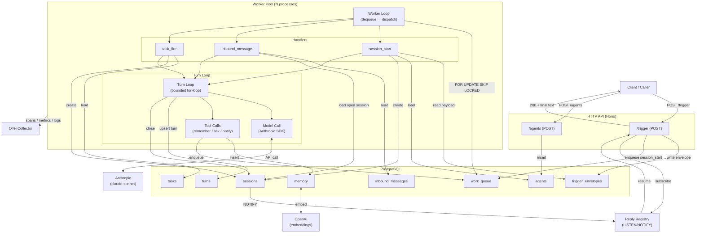
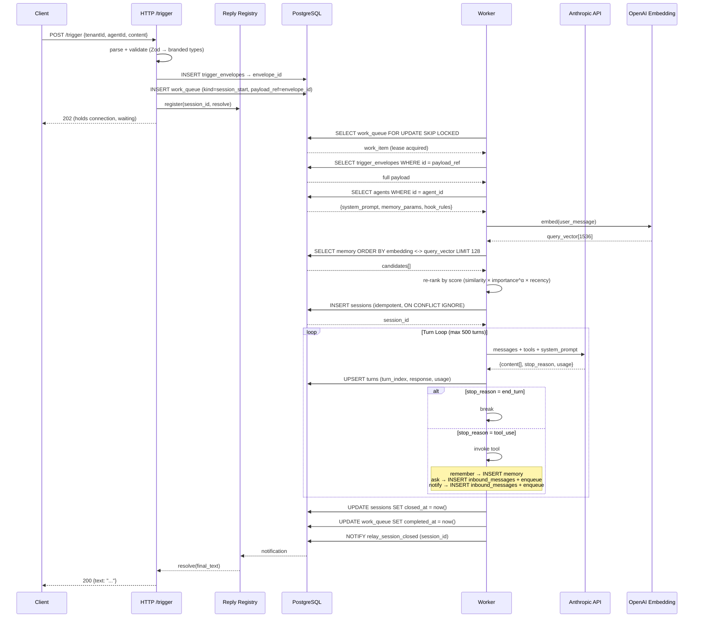
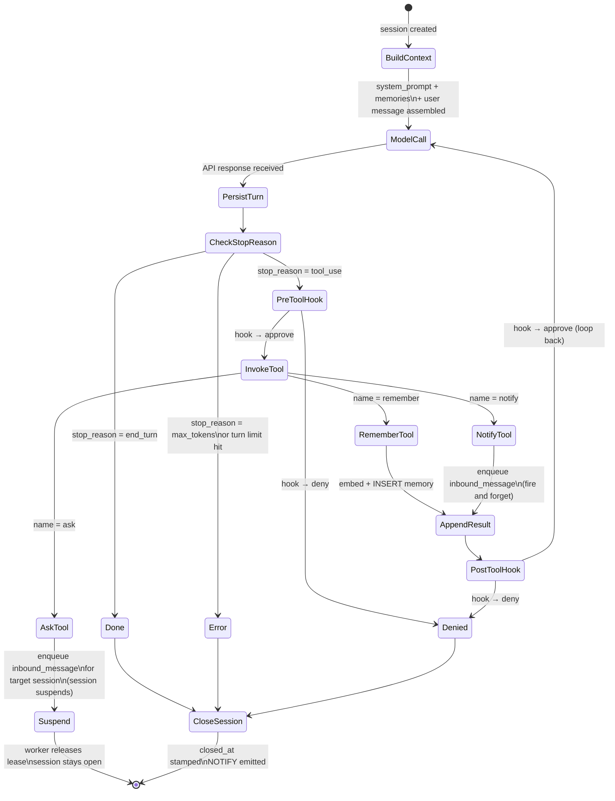
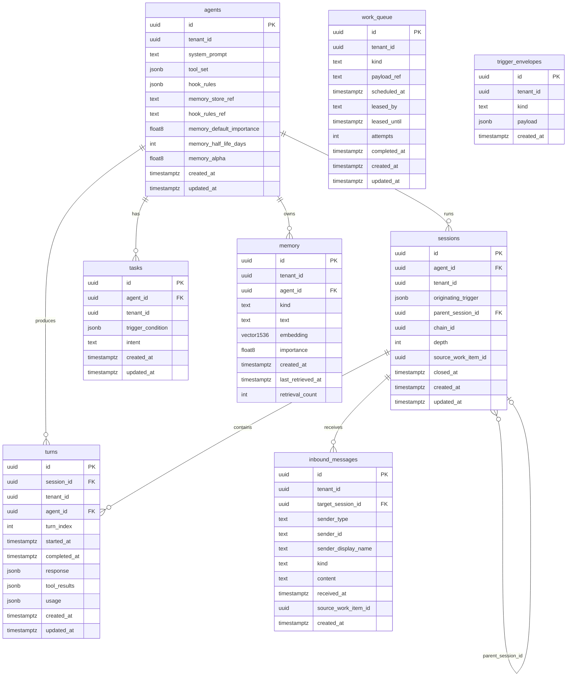
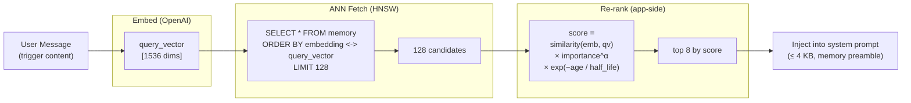
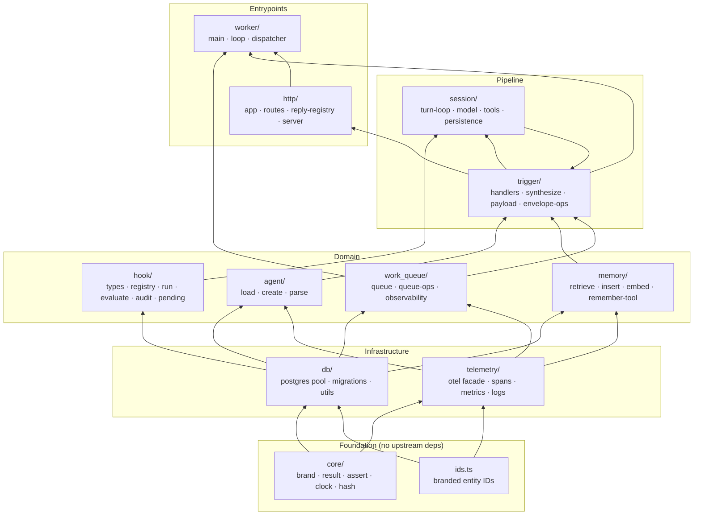
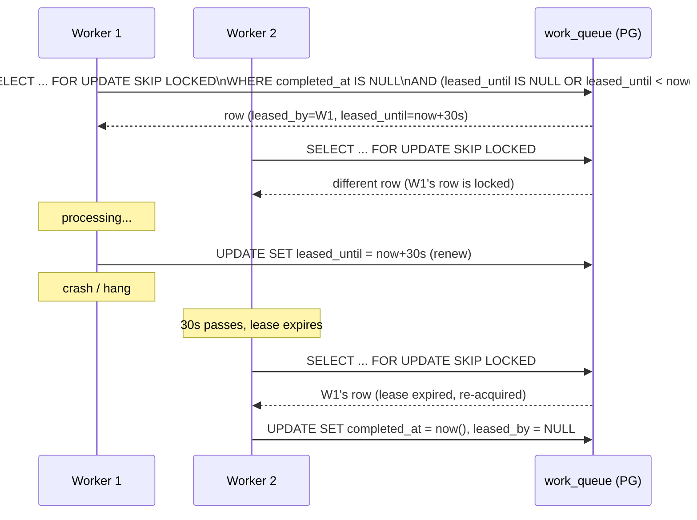

# Relay Architecture

Diagrams of the core runtime. Read alongside `SPEC.md` (data model) and `CLAUDE.md` (engineering rules).

---

## 1. System Overview

---

## 2. Request → Response Flow

Detailed sequence for a synchronous `POST /trigger` call.

---

## 3. Turn Loop (State Machine)

---

## 4. Database Schema (ER)

---

## 5. Memory: Retrieval Scoring

How memories are ranked for injection into the opening context.

**Score factors:**

| Factor       | Source                           | Column                         |
| ------------ | -------------------------------- | ------------------------------ |
| `similarity` | cosine distance (pgvector `<->`) | `memory.embedding`             |
| `importance` | agent-set or distilled (0–1)     | `memory.importance`            |
| `α`          | agent tuning parameter           | `agents.memory_alpha`          |
| `half_life`  | agent tuning parameter (days)    | `agents.memory_half_life_days` |
| `age_days`   | `now() - memory.created_at`      | computed                       |

---

## 6. Subsystem Dependency Graph

Import direction; no cycles.

---

## 7. Work Queue & Lease Protocol

How distributed workers coordinate without external state.

**Key columns:**

| Column         | Meaning                                                              |
| -------------- | -------------------------------------------------------------------- |
| `leased_by`    | Worker ID holding the lease (`NULL` = available)                     |
| `leased_until` | Expiry timestamp; past = available for re-lease                      |
| `completed_at` | `NULL` = pending/in-flight; set = done (excluded from dequeue)       |
| `attempts`     | Incremented on each lease; surface in metrics                        |
| `payload_ref`  | Points at `trigger_envelopes.id` (≤ 512 bytes; not the full payload) |
